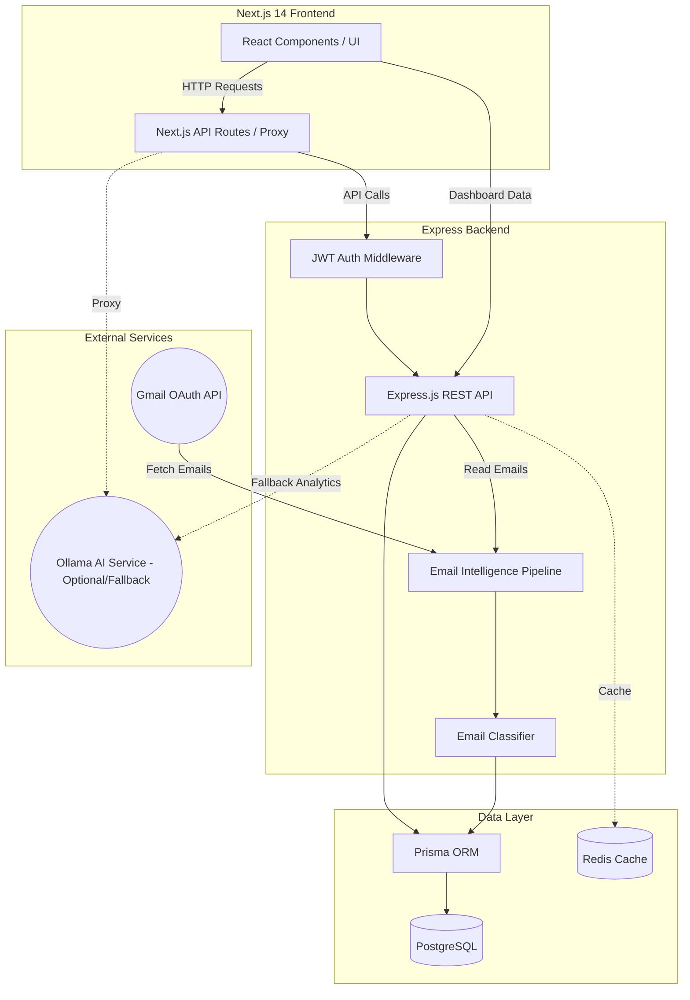

# Atomberg Goal Portal — Architecture

This document describes the high-level architecture of the Atomberg Goal Portal.

## Architecture Diagram

## System Components

- **Frontend:** Built with Next.js 14 (App Router), React, and Tailwind CSS.
- **Backend:** Express.js REST API with Prisma ORM.
- **Database:** PostgreSQL container for robust relational data storage.
- **AI Integration:** Local inference powered by Ollama (gemma3 model) gracefully degrading to backend mock endpoints.
- **Email Intelligence:** Pipeline consuming Gmail OAuth, passing content through a classifier, storing structured data in DB, and served to the Dashboard.