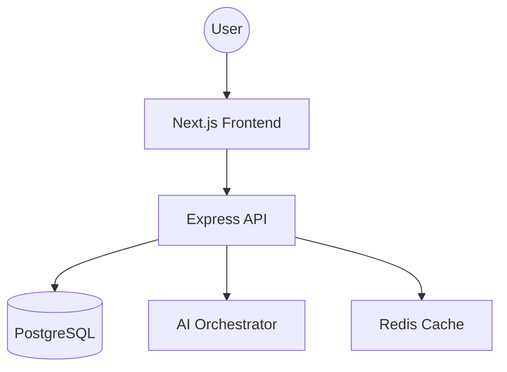

# Atomberg Goal Portal - AI-Powered Performance Management

Built for AtomQuest Hackathon 2026. This portal helps Atomberg Technologies track goals across R&D, Manufacturing, and Sales with AI-driven insights and automated check-ins.

## Architecture



## Tech Stack
- **Frontend:** Next.js 14, Tailwind CSS, shadcn/ui, Zustand, Recharts.
- **Backend:** Node.js, Express, TypeScript, JWT, RBAC.
- **Database:** PostgreSQL + Prisma ORM.
- **AI:** Custom Intent Classification & SQL Generation.

## Setup Instructions

1. **Clone & Install:**
   ```bash
   git clone <repo-url>
   cd goal-portal
   npm install
   ```

2. **Infrastructure:**
   ```bash
   docker-compose up -d
   ```

3. **Database Setup:**
   ```bash
   npm run db:push
   npm run db:seed
   ```

4. **Run Development:**
   ```bash
   npm run dev
   ```

## Demo Credentials
- **Admin:** `admin@atomberg.com` / `admin123`
- **Manager (Manufacturing):** `manager1@atomberg.com` / `manager123`
- **Manager (B2B):** `manager2@atomberg.com` / `manager123`
- **Employee:** `employee1@atomberg.com` / `employee123`

## AI Features
- Natural Language Queries for goal status.
- Automated weightage validation.
- Contextual suggestions for performance improvement.
